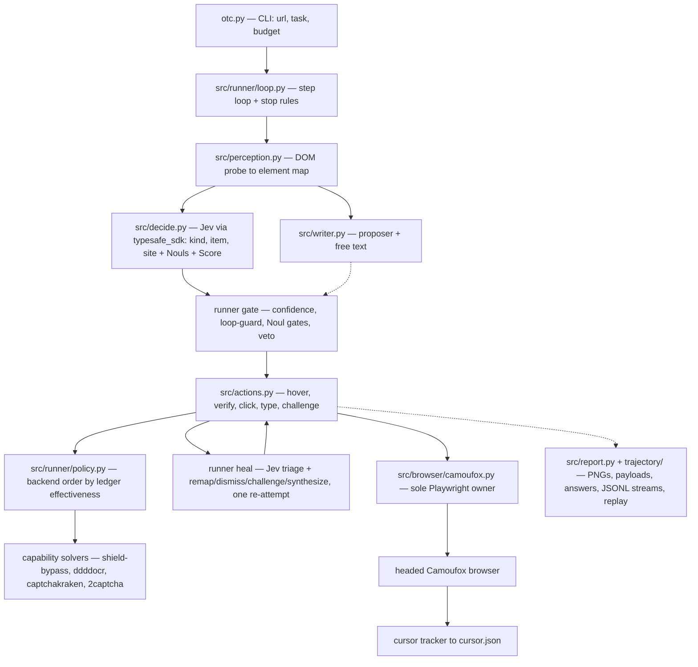
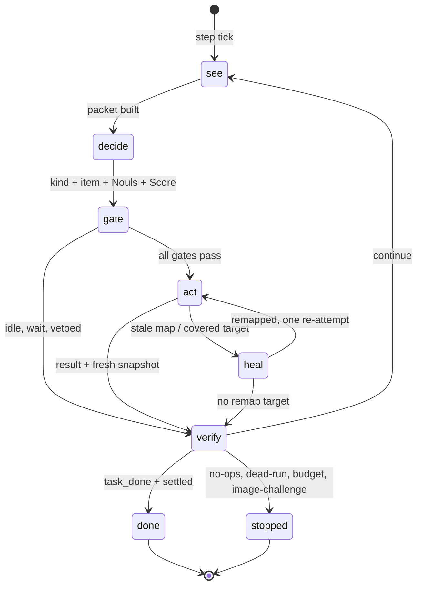

# open-typesafe-camoufox

A CLI tool that drives a headed Camoufox browser toward a goal you type in
plain English — for about $0.0002 a step. It never sends a screenshot to a
big model. Instead it reads the page deterministically, asks the Jev
classifier which action comes next (over the official
`pydantic-ai-slim[typesafe]` SDK transport — no hand-rolled HTTP), works
through bot-checks with a ranked chain of solver backends, and only calls
a writing model when a text field genuinely needs free text.

```bash
otc --url https://www.google.com --task "Type ONE surprising moon fact in the search box, press Enter, read the top result, and mark done."
```

(`otc` here is `uv run otc.py` from a source checkout — see [Install](#install). When
packaged, `pyproject [project.scripts]` installs real `otc` /
`open-typesafe-camoufox` commands.)

Shaped after [`typesafe-computer-use`](https://github.com/awlevin/typesafe-computer-use);
CLI ergonomics take a leaf from [`camoufox-cli`](https://github.com/Bin-Huang/camoufox-cli)
(one installable command, flags-over-config, offline replay).

## Why this exists (start here)

[Why This Exists — GTM Engineer's Guide](docs/WHY_THIS_EXISTS.md): the
belief (the loop itself picks the lowest-cost model per decision), the
journey (what failed and why we refactored it away), the state-machine
diagrams, and why each part is there. Open that first if you're new.

## Table of Contents

- [Why this exists](#why-this-exists-start-here)
- [What it is](#what-it-is)
- [What it does](#what-it-does)
- [How it works](#how-it-works)
- [System diagrams](#system-diagrams)
- [Goal](#goal)
- [Goal: earn $1 USDC on Solana](#goal-earn-1-usdc-on-solana)
- [What we did here](#what-we-did-here)
- [Ask the system itself (no-README mode)](#ask-the-system-itself-no-readme-mode)
- [Why this decision-making shape](#why-this-decision-making-shape)
- [Install](#install)
- [Use](#use)
- [How a step works](#how-a-step-works)
- [What fires when (capability trigger map)](#what-fires-when-capability-trigger-map)
- [Run folder](#run-folder)
- [Caveats](#caveats)
- [Layout](#layout)
- [Development](#development)
- [References](#references)

## What it is

`open-typesafe-camoufox` ([`otc.py`](otc.py), [`pyproject.toml`](pyproject.toml)) is an
open-source browser agent: a Python program that operates a real,
headed [Camoufox](https://camoufox.com) browser window the way a person
would — moving a humanized cursor, clicking, typing, submitting forms,
opening tabs — in pursuit of a plain-English task. It is built for
**cheap, observable computer use**: every step costs a fraction of a cent
and leaves a full audit trail (see [Run folder](#run-folder)).

## What it does

Given a starting URL and a task, `otc` loops until the task is observably
complete (or budget/steps run out):

- **Reads** the live page into structured data (element map, focused
  field, visible text) via [`src/perception.py`](src/perception.py)
- **Decides** the single next action with the Jev classifier
  ([`src/decide.py`](src/decide.py)) over 12 mutually exclusive action
  kinds, gated by confidence and Noul flags — one System One request per
  step (kind/item/site Choices, five Nouls, one progress Score) through
  the official `typesafe_sdk` client; the versioned model id that
  answered is recorded per run (`run.json → jev_model`)
- **Proposes** with a small writer model ([`src/writer.py`](src/writer.py))
  when a step needs reasoning or free text
- **Acts** through humanized cursor primitives
  ([`src/actions.py`](src/actions.py)) executed solely by the platform
  adapter ([`src/browser/camoufox.py`](src/browser/camoufox.py))
- **Solves** bot-checks with an evidence-ranked backend chain
  (`shield-bypass` native checkbox/token poll → `ddddocr` OCR →
  `captchakraken` hosted vision grids → `2captcha` paid fallback),
  ordered by past success mined from `runs/*/steps.jsonl`
- **Verifies** every outcome, adopts new tabs, records everything, and
  stops honestly (`done`, budget, or explicit stop rules) via
  [`src/runner/loop.py`](src/runner/loop.py)

## How it works

Each step walks an explicit phase machine —
`see → decide → gate → [act] → verify`, driven by the declarative engine
([`src/machine/run_engine.py`](src/machine/run_engine.py),
spec: [`src/machine/run_machine.ts`](src/machine/run_machine.ts))
— a stale/covered click detours `act → heal → act` for exactly one Jev-triaged recovery (remap / dismiss / challenge / gated synthesis), 
else heal -> verify accounts it. State diagram is machine-generated (docs/run_machine.dot):

1. **See** ([`src/perception.py`](src/perception.py)) — screenshot the page, probe
   the DOM into an element map (aria snapshot: native `eN` refs, roles,
   names, landmark regions; no DOM markers), read the
   focused field (role/label/placeholder/value, credential flag) and the
   visible page text (the reading ground truth). Bank notes and visited
   URLs for long-horizon memory, plus scored page memory: each settled
   page is fetched as Reader JSON (Jina, with a crawl4ai DOM-extraction
   fallback — library only, Camoufox stays the sole browser), chunked,
   stored in `memory.jsonl`, reranked against the task, and the winners
   recalled into the state packet JEV reasons over.
2. **Propose + decide** ([`src/writer.py`](src/writer.py),
   [`src/decide.py`](src/decide.py)) — the writer poses the single best
   action as a yes/no question; one Jev request answers three `Choice`
   sets (`kind` / `item` / `site`), five Noul flags (`page_ready`,
   `needs_text`, `task_done`, `fits`, `approval`), and one `Score`
   (`progress`). Structured options carry label/text/href/fill-state/
   selector, and kinds carry what/not-for boundaries. Transport is the
   official `typesafe_sdk` client (`AsyncTypeSafeClient.system_one`
   with typed `Choice`/`Noul`/`Score` questions, SDK retries) — the
   protocol is unchanged, only the HTTP is no longer hand-rolled.
   Dictated by [`pydantic-ai`'s TypeSafe model docs](https://pydantic.dev/docs/ai/models/typesafe/):
   state holds judged material only, every judgment lives in a question,
   one judgment per field; Noul confidence is margin-doubled and
   pick-one confidence spread-based (neither is P(correct)), so gates
   stay empirically tuned and `TYPESAFE_MODEL` should be pinned to a
   versioned id (e.g. `jev-1.13.0`) before calibrating thresholds.
3. **Gate** ([`src/runner.py`](src/runner.py)) — confidence gate,
   loop-guard (three identical targets force a wait), Noul gates
   (`ready` only adds patience, `text?` gates the writer call, `done?`
   must agree before `done`), bare-input-click veto, stale-map and
   point checks.
4. **Act** ([`src/actions.py`](src/actions.py) →
   [`src/browser/camoufox.py`](src/browser/camoufox.py)) — scroll into
   view, cursory-recorded highlight ring, re-measure, verify the click
   point, then click / type (clear-before-type) / press key / refresh /
   back / goto / challenge. Challenge runs a staged plan
   ([`src/runner/policy.py`](src/runner/policy.py)) instead of one shot:
   open image grids go to vision/OCR (never re-clicked — that closes the
   popup, and no Escape on iframe covers for the same reason); otherwise
   native shield solve → verified toggle → paid fallback. Every solver
   attempt carries its own logs inside its structured response, and the
   plan order follows ledger effectiveness (see [Solver backends](#solver-backends)).
5. **Verify** — adopt new tabs (harvest old buffer, bind the new page,
   restart the tracker), fingerprint the outcome, enforce stop rules.
   Full details per phase: [What fires when](#what-fires-when-capability-trigger-map).

## System diagrams

Architecture — how the pieces connect:



Step loop — the state machine every step walks:



## Goal

Make browser computer-use **just work** on Camoufox: cheap enough to run
all day, reliable enough to trust with real tasks (sign-in, search, read),
and observable enough to debug offline when it stalls. The project started
as `open-jev-solver` (a 2-tool pydantic harness) and was refactored into
this shape once live runs showed the costs clearly.

## Goal: earn $1 USDC on Solana

The standing end-to-end target: **earn $1 USDC on the Solana chain** to
wallet `d8XdEYRHvti6WZNEuohJqENHVGVwMxS9F1PXg5kxBMo`.

Stated honestly: `otc` has no wallet, no accounts, and no payment rails —
it cannot earn or move crypto by itself, and bot-checks/CAPTCHAs are stop
conditions, not puzzles to defeat. What the loop *can* do, recursively
until it works, is the research leg: find legitimate beginner routes to
$1 USDC on Solana (faucets, learn-to-earn, microtasks, freelance gigs paid
in crypto), open the most promising results, read pay rates/requirements/
payout methods, and report the top options with a note quoting each page.

Judgment criteria for a run (in order):
1. `done=True` with a note naming concrete routes + amounts — complete.
2. Sustained multi-page progress (25 steps, new tabs adopted, notes
   banked on distinct URLs) without ever re-clicking a dead target.
3. Anything else is a stall: fix the decision, not the step count.

## What we did here

1. **Speed + consistency.** Profiled the cursor and found each humanized
   dispatch cost ~1.35s and gestures stacked wobble on wobble (model curve
   + radius jitter + per-dispatch bezier). Now: one `HUMANIZE_LEVEL = 0.3`
   constant (~0.35s/dispatch), 1–2 dispatches per move, one clean 5-hop
   ellipse highlight. Steps went from ~17–19s to ~4–6s.
2. **Clear-before-type.** The planner typed into already-filled inputs and
   the query concatenated every step. Every `type` now selects-all and
   deletes first, so typing always replaces.
3. **The typesafe flip.** The big planner LLM did the real per-step work
   while Jev was a `conf=0.00` braille hint nobody used — the most
   expensive possible arrangement. Inverted: **Jev classifies
   (kind/item/site) over the DOM element map with confidence gating; a
   small writer model composes free text only.** Verified live:
   `type_at 0.97` → `press_enter 0.88` → `wait` (loading, neutral — no
   retype, no accumulation) → `done`, 4 steps, `done=True`.
4. **One platform adapter + replay parity.** Collapsed two capability
   classes and deleted the dead video-agent verbs/schemas. Every step
   writes raw + annotated screenshots, the exact Jev payload, and the full
   probability answers — stalls replay offline with `--replay`.
5. **Official Jev transport.** Replaced hand-rolled httpx with
   `pydantic-ai-slim[typesafe]` (`AsyncTypeSafeClient.system_one`, typed
   Choice/Noul/Score) — same protocol, official retries; fixed the
   `/v1/v1` base-URL doubling it exposed; each run records the versioned
   model id that answered.
6. **Ranked solver chain.** Checkbox challenges run a policy-ordered plan
   (vision → OCR → shield → toggle → paid) ranked by ledger effectiveness
   mined from `runs/*/steps.jsonl`, with popup-preservation rules (never
   re-click open grids, no Escape on iframe covers) and per-attempt logs
   inside every structured response.
7. **Real grid solves.** Hosted vision (numbered overlay → Abyss rounds →
   humanized tile clicks → verify gate) clears live reCAPTCHA grids to a
   token; paid 2captcha covers the remainder with proxy-matched egress.
8. **Structured everything.** `[layer:domain:action] key=value` feed,
   formatted-JSON record blocks, `run_id`+`seq` trajectory envelope,
   `memory.jsonl` recall, solver ledger — grep one tag, get one subsystem.

## Ask the system itself (no-README mode)

For people who don't have the patience for the rest of this README: the
system answers questions about itself in plain English — no API keys, no
browser, no model, just keyword routing over a hand-maintained
capability index ([`src/explain.py`](src/explain.py)).

```bash
uv run otc.py --explain "what does this do?"    # answer one question
uv run otc.py --explain                          # list all topics + key status
uv run otc_explain.py "how are bot checks solved?" --full   # with detail
uv run otc_explain.py --list                     # topic index
```

Twenty topics: what-it-is, the-loop, jev-classifier,
decision-questions, writer-model, bot-checks, humanized-cursor,
run-folder, page-memory, frontier, mission, recovery, no-key-offline,
install, usage, cost, stop-rules, limitations, typesafe-slice, and
**recent-updates** — the last summarizing the work done recently (crawl
frontier ledger, solver ledger ranking, Jev-scored recovery/restart,
mission driver, official SDK transport, humanize-default-off, 3-4x
faster steps). No-match falls back to the topic index, so the answer is
always honest about what it can explain.

## Why this decision-making shape

Frontier-model computer use ships a screenshot and waits seconds for a
plan, every step. Most steps don't need a plan — they need one choice from
a short, mutually exclusive list, with a confidence number to gate on.
[TypeSafe](https://docs.typesafe.ai) (Jev, "System One") is best-in-class
for exactly that: a decision model answering `Choice` over up to 255
options with a full probability distribution and calibrated confidence, in
a few hundred milliseconds, with free output tokens. So the loop is built
around it: Jev picks *what to do*, a small writer model only writes *words*
when a field genuinely needs them, and code revalidates everything
(URLs must be clean https, credentials are never free-typed, secrets
resolve from `{ENV}` placeholders at execution and never enter prompts).

## Install

Python 3.11+, [uv](https://docs.astral.sh/uv/).

```bash
git clone <this-repo> open-typesafe-camoufox
cd open-typesafe-camoufox
uv sync
cp .env.example .env.local   # fill GROQ_API_KEY + TYPESAFE_API_KEY
uv run otc.py --url https://example.com --preflight   # proves keys + headed browser
```

`uv run otc.py` is the call shape (a source checkout, like
`camoufox-cli`'s daemon model but without the install step). After
`pip install .`, the `[project.scripts]` entry points give you bare `otc`.
The writer is provider-driven via `WRITER_*` env (OpenAI-compatible `chat`,
`response`, or `messages` API shapes — see [`.env.example`](.env.example));
it falls back to `GROQ_*` when unset.

## Use

```bash
uv run otc.py --url https://www.google.com --task "Type ONE surprising moon fact in the search box, press Enter, read the top result, and mark done." --budget 240 --max-steps 20
uv run otc.py --url https://x.com/login --task "Sign in with {TWITTER_USERNAME} / {TWITTER_PASSWORD}" --budget 120
uv run otc.py --url https://example.com --preflight
uv run otc.py --replay runs/<timestamp> --replay-step 3   # offline, no browser
uv run otc.py --url ... --task ... --legacy-planner       # old GPT planner loop (fallback)
```

While a run is going, steer it from another terminal via `steer.txt`
(`stop` | `goto <url>` | `pause` | `resume` | any instruction).

## How a step works

Screenshot → element map ([`src/perception.py`](src/perception.py): DOM probe,
reading order, native aria `eN` refs, lazy boxes at ACT, zero DOM mutation) + focused field
(role/label/placeholder/value, credential flag) + page text (visible words
— the reading ground truth). Then the writer proposes the single best
action as a yes/no question ([`src/writer.py`](src/writer.py)), and one Jev
request answers ([`src/decide.py`](src/decide.py)):

- `kind` — one of 12 verbs (`wait`, `click_item`, `type_at`,
  `press_enter`, `press_escape`, `refresh`, `back`, `close_others`,
  `goto`, `challenge`, `done`, `none`), each with a what/not-for boundary
- `item` — which element idx, as structured options
  (label/text/href/fill-state/selector)
- `site` — which catalog URL (`goto` targets)
- Noul flags — `page_ready`, `needs_text`, `task_done`, `fits`,
  `approval` (on the LLM-posed question)
- `Score` — `progress` on the task spectrum

`wait` is patience, not doubt: a loading page idles without counting
toward the stop rule, so the loop can never retype into a transition (the
old query-accumulation bug is structurally impossible). `done` is accepted
only on a settled page with real text. Clicks that open a new tab are
auto-adopted (harvest old buffer, bind the new page, restart the tracker)
so the next step reads the new content instead of re-clicking; `refresh`
reloads a stale tab and `close_others` trims tabs while always keeping the
current tab and its opener (a click-opened popup dies with its opener in
this build — verified live). Nav listeners are generation-guarded: after an
adoption, events from stale tabs are ignored so a dead tab can't clobber
the URL bookkeeping or fire tracker recovery on the wrong tab. A tab switch starts a 4-step reading cooldown:
the fresh tab's DOM is recaptured with a digest immediately, `goto` is
refused until the cooldown ends, and the proposer is told to read the
adopted page instead of navigating away.

Each step walks an explicit phase machine —
`see → decide → gate → [act] → verify`, ending `done`/`stopped`
(idle paths skip `act`; illegal transitions raise instead of drifting).
`verify` fingerprints the outcome: a settled page identical to the last
step means the action changed nothing, twice in a row ends the run
honestly. The three Noul flags ride along: `page_ready` can only add
patience (never override the loading check), `needs_text` gates the
writer call, `done?` must agree before `done` is accepted. `progress`
scores the run on the task-completion spectrum for long-horizon tracking.

## What fires when (capability trigger map)

Decide path (default, `otc --url … --task …`):

| phase | module | fires |
|---|---|---|
| see | [`perception`](src/perception.py) | element map, focused field, page text, tabs; banks notes + visited |
| decide | [`decide`](src/decide.py) (Jev) | kind/item/site Choices + page_ready/needs_text/task_done/approval Nouls + progress Score |
| propose | [`writer`](src/writer.py) (Groq) | reads all elements + URLs, poses the single best action as the approval question |
| gate | [`runner/loop.py`](src/runner/loop.py) | confidence gate, loop-guard, Noul gates |
| act | [`actions`](src/actions.py) → [`platform`](src/browser/camoufox.py) | click/type/enter/refresh/goto/close/challenge; auto-adopts new tabs |
| challenge plan | [`runner/policy.py`](src/runner/policy.py) | ledger-ranked backend order per challenge (never re-clicks open grids) |
| solvers | [`capability/shield_solve.py`](src/capability/shield_solve.py), [`captcha_ocr.py`](src/capability/captcha_ocr.py), [`grid_solve.py`](src/capability/grid_solve.py), [`twocaptcha_client.py`](src/capability/twocaptcha_client.py) | native checkbox/token poll → ddddocr OCR → hosted vision grids → paid fallback; each attempt logs inside its own structured response |
| heal | [`runner/loop.py`](src/runner/loop.py) + [`decide`](src/decide.py) + [`actions`](src/actions.py) | stale/covered click → Jev triage (challenge strategies only fit real controls) → remap / dismiss / challenge / gated synthesis, one re-attempt |
| memory | [`runner/memory.py`](src/runner/memory.py) + [`capability/jina_client.py`](src/capability/jina_client.py) | Reader JSON → chunks → `memory.jsonl` → rerank recall into state |
| act | [`writer`](src/writer.py) | only on `type_text` (non-credential) and off-catalog `goto` |
| verify | [`runner`](src/runner.py) | fingerprint vs last step, no-op and dead-run stops |

Legacy path (`--legacy-planner`): `read_frame` → braille → `decide_cursor`
hint; `build_step_agent` planner → `JevStep`; `JevCapability.move_cursor`
executes. Uses `jev_agent`, `jev_tools`, `jev_actions`, `agent_runner`.
Shared by both: the `platform` adapter, tracker, human motion, run folder.

## Solver backends

Challenge solving is evidence-ranked, not hardcoded. [`src/trajectory/solver_ledger.py`](src/trajectory/solver_ledger.py)
derives per-solver `{attempts, successes, rate}` from `runs/*/steps.jsonl`
itself (no sidecar to diverge — the runs *are* the memory), and
[`src/runner/policy.py`](src/runner/policy.py) orders each challenge plan
by ledger score, with operator priors (`captchakraken` 0.8,
`shield-bypass`/`ddddocr` 0.0 for grids) ruling only until real evidence
accumulates. The rank tail rides every result into `steps.jsonl`
(`solver_rank`), the history text, and the persistent notes — so JEV
reasons over past backend effectiveness with its existing machinery.

| solver (ledger name) | library | fires when | needs |
|---|---|---|---|
| `capability:shield-bypass:checkbox` | [shield-bypass](https://github.com/genguzzz/shield-bypass) port, stock Playwright | framed checkbox, known family (Turnstile/reCAPTCHA) | nothing |
| `actions:toggle` | ours (verified dispatch) | always (the plain click) | nothing |
| `capability:ddddocr:ocr` | [ddddocr](https://github.com/sml2h3/ddddocr) | open image grid (capture for JEV review) | nothing |
| `capability:captchakraken:grid` | [CaptchaKraken](https://github.com/JWriter20/CaptchaKraken) hosted Abyss | open image grid (tile discovery → numbered overlay → model rounds → tile clicks → verify gate) | `CAPTCHA_KRAKEN_API_KEY` |
| `capability:2captcha-python:solve` | [2captcha](https://github.com/2captcha/2captcha-python) | toggle dispatch failed | `APIKEY_2CAPTCHA` + matched proxy |

Rules the loop enforces: an open grid is never re-clicked (that closes the
popup) and Escape is never dispatched on iframe covers (same effect);
paid backends only plan when key + proxy are configured; token values never
enter records or logs (lengths only); every attempt carries its own `logs`
trail inside its structured response.

## Run folder

Every run writes `runs/<timestamp>/`:

| file | contents |
|---|---|
| `run.log`, `run.json` | everything printed; goal, outcome, seconds, config |
| `step-NN-raw.png` | the screenshot capture |
| `step-NN.png` | elements numbered blue, chosen red, focused field green |
| `step-NN-payload.jsonl` | pydantic-validated JSON line: state + questions + full Jev answers (rankings) + decision |
| `step-NN-answers.json` | every probability the classifier returned |
| `transcript.jsonl`, `cursor.json` | per-step lines + cursor trail |
| `steps.jsonl` | canonical machine transcript: one validated `StepRecord` per step (intent, calls, result, solver blocks, `solver_rank`) |
| `wire.jsonl`, `frontier.jsonl` | full element maps + crawl-ledger events (all streams carry `run_id`+`seq`, joinable) |
| `memory.jsonl` | scored page-memory chunks (`url/section/text/score/source`) |
| `captcha-NN.json`, `shield-NN.json` | per-step OCR / shield-solve audit records |
| `run.json` | summary incl. the versioned Jev id that answered (`jev_model`) |

Live feed format: every console line is `[layer:domain:action] key=value …`
(e.g. `[jev-solver:decision:select] action=challenge conf=0.96`,
`[capability:grid:click] tile=4 result=success`). Structured payloads
print as indented JSON blocks instead of inline blobs; full records live
in the JSONL streams above. Grep by tag to isolate one subsystem.

## Caveats

- **Headed by default** (`--headless` opts out): watch the window and keep
  hands off mouse/keyboard/focus while it runs — a background idle-motion
  loop keeps the cursor alive and fights you for it.
- Needs `GROQ_API_KEY` + `TYPESAFE_API_KEY`; without the latter Jev falls
  back to a heuristic and grounding goes blind (`conf=0.00`).
- Solver backends are opt-in BYOK: `CAPTCHA_KRAKEN_API_KEY` (+ optional
  `VLLM_BASE_URL`, default hosted) for vision grids, `APIKEY_2CAPTCHA` +
  `TWOCAPTCHA_PROXY_*` for paid fallback (browser egress routes through
  the same proxy or solves are refused — mismatched IPs burn money),
  `JINA_API_KEY` for rerank recall (Reader works anonymously at 20 RPM).
  Unconfigured backends refuse loudly and cost nothing; screenshots
  leave the machine on hosted backends (see each backend's privacy note).
- Element-map targeting only sees the DOM — canvas/icon-only controls are
  invisible to it (pixel fallback is future work).
- Slow pages burn steps on `wait`; raise `--budget`/`--max-steps` for them.
- Long collection missions use `--mission`: stopped sessions relaunch with
  covered URLs seeded (shared step/wall-clock budget, max 10 sessions), so a
  transient stall can never end the mission early. Stop rails scale with
  `--max-steps`; noop steps run the recovery cycle (classify → compensate →
  verify, audited per step) instead of just counting down.
- Passwords are only filled from `{ENV}` placeholders declared in `--task`
  (see [`.env.example`](.env.example)); the writer will never invent credentials.
- `runs/` and `.env.local` are git-ignored; never commit secrets.

## Layout

| Module | File | Role |
|---|---|---|
| runner | [`src/runner/loop.py`](src/runner/loop.py) | Jev-primary step loop, stop rules, steer |
| policy | [`src/runner/policy.py`](src/runner/policy.py) | pure backend order + stage→action table |
| memory | [`src/runner/memory.py`](src/runner/memory.py) | scored page recall (Reader/rerank → notes) |
| perception | [`src/perception.py`](src/perception.py) | element map, focused field, page text, state packet |
| decide | [`src/decide.py`](src/decide.py) | Jev selector over official SDK transport (kind/item/site + confidence) |
| writer | [`src/writer.py`](src/writer.py) | small-model free text ({fill,text}/{ok,url}) |
| actions | [`src/actions.py`](src/actions.py) | one handler per kind -> history line |
| platform | [`src/browser/camoufox.py`](src/browser/camoufox.py) | the ONLY module touching playwright/camoufox |
| report | [`src/report.py`](src/report.py) | byte-writers (PNGs, payload, answers, JSONL streams) |
| trajectory | [`src/trajectory/`](src/trajectory/) | replay, lessons, solver ledger (stats derive from `runs/`) |
| capability | [`src/capability/`](src/capability/) | browser verbs: shield_solve, captcha_ocr, grid_solve, twocaptcha_client, jina_client, crawl_extract, stage, tiles, human_move, cursory highlight |
| backends | [`src/capability/backends/`](src/capability/backends/) | provider interfaces: OCR (local ddddocr / FastAPI service), paid solvers, Kraken vision |
| deps | [`src/deps.py`](src/deps.py) | typed RunState (replaces __jev_* string tuples) |
| machine | [`src/machine/run_machine.ts`](src/machine/run_machine.ts) | xstate v5 run-machine spec + [`EDGE_CASES.md`](src/machine/EDGE_CASES.md) |
| explain | [`src/explain.py`](src/explain.py) | offline capability Q&A + keyword router (no keys, no model) |
| cli | [`src/run/run.py`](src/run/run.py) | CLI (`otc`), env loading, logging |
| legacy | [`src/run/agent_runner.py`](src/run/agent_runner.py) | GPT planner loop (`--legacy-planner` only) |

Supporting: [`otc.py`](otc.py) + [`otc_explain.py`](otc_explain.py) +
[`run_fact.py`](run_fact.py) entry points,
[`tests/`](tests/) (469 passing via `uv run python -m pytest -q`),
[`docs/LIBRARIES.md`](docs/LIBRARIES.md),
[`scripts/jev_hooks.py`](scripts/jev_hooks.py),
[`.opencode/skills/open-typesafe-camoufox/SKILL.md`](.opencode/skills/open-typesafe-camoufox/SKILL.md),
[`lefthook.yml`](lefthook.yml), [`pyproject.toml`](pyproject.toml).

## Development

```bash
uv run python -m pytest -q
```

Git hooks via [lefthook](https://github.com/evilmartians/lefthook)
(`lefthook.yml`, Jev-backed — see `scripts/jev_hooks.py` + `docs/LIBRARIES.md`):

```bash
npm install          # one-time: provides the lefthook binary
npx lefthook install # one-time per clone: wires .git/hooks
```

- `pre-commit` classifies/maps staged `.py` files (advisory; `--strict` to block).
- `pre-push` ranks pushed `.py` files by Jev issue score and blocks on
  ≥ 0.75. Files scoring ≥ 0.35 get a per-window Noul scan, and hot
  windows (≥ 0.6) get an issue-kind Choice, so the report names exact
  line ranges (`L102-L150 (0.81): race-condition`). Tune with
  `--line-floor`, `--line-hot`, `--window`, or target files directly
  with `--files` (skips scope detection).
- Bypass with `git push --no-verify` or `JEV_HOOKS_OFF=1`.
- No key / no network → heuristic fallback, never blocks.

## References

- [TypeSafe docs](https://docs.typesafe.ai) — Choice/Score/Noul primitives, confidence, Jev models
- [pydantic-ai TypeSafe models](https://pydantic.dev/docs/ai/models/typesafe/) — `TypeSafeModel` contract our transport follows (state holds judged material, one judgment per field, confidence semantics, version pinning)
- [shield-bypass](https://github.com/genguzzz/shield-bypass) — native checkbox/token technique ported in `shield_solve.py`
- [ddddocr](https://github.com/sml2h3/ddddocr) — offline OCR behind `captcha_ocr.py` (also: [FastAPI wrapper](https://github.com/sml2h3/ddddocr-fastapi))
- [CaptchaKraken](https://github.com/JWriter20/CaptchaKraken) — hosted vision grids behind `grid_solve.py`
- [2captcha-python](https://github.com/2captcha/2captcha-python) — paid fallback behind `twocaptcha_client.py`
- [crawl4ai JSON extraction](https://crawl4ai.com) — `JsonCssExtractionStrategy`/`RegexExtractionStrategy` used library-only (no crawler; Camoufox is the sole browser) in `crawl_extract.py`
- [cursory](https://github.com/Vinyzu/cursory) — recorded-human mouse trajectories behind the highlight ring
- [`typesafe-computer-use`](https://github.com/awlevin/typesafe-computer-use) — the reference cheap-computer-use loop this project is shaped after
- [`camoufox-cli`](https://github.com/Bin-Huang/camoufox-cli) — CLI ergonomics reference (one command, flags-over-config)
- [Camoufox](https://camoufox.com) — the anti-detect browser underneath `src/browser/`
- [uv](https://docs.astral.sh/uv/) — Python package + project manager used here
- [lefthook](https://github.com/evilmartians/lefthook) — git hooks manager wiring the Jev hooks
