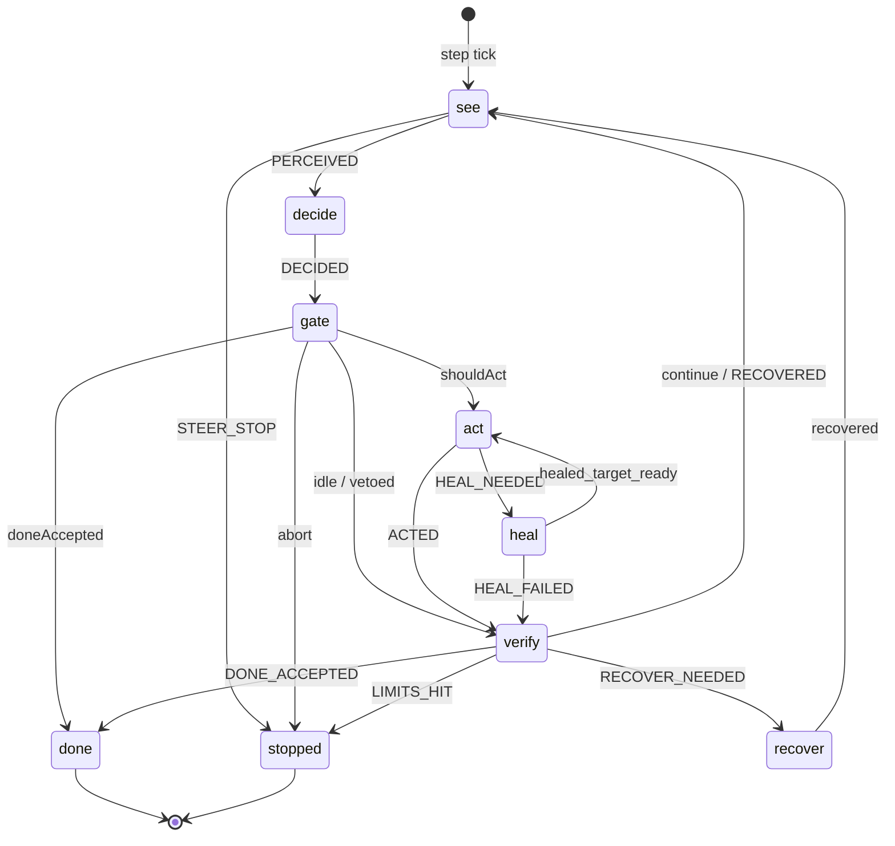
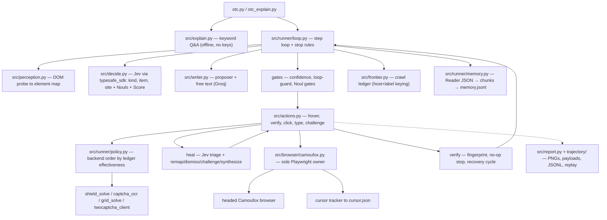

# Why This Exists

Hey, I'm Matthew. I'm a go-to-market engineer who has just recently started
up my own agency, and I love building and detecting proxy and automation
tools. This repo has been somewhat of a journey — every idea in it was
tried, measured on live runs, and kept only if it earned its keep.

[Follow on Twitter → @matthewsoldit](https://x.com/matthewsoldit/status/2100702040938934493)

## The Belief That Started It

I believe the browser should be able to **directly select the lowest-cost
model possible** for each decision. Not "pick a cheap model once and hope
for the best" — the *loop itself* should pick. That's the whole point of
this repo: a decision model (Jev / "System One") that costs ~$0.0002 and
takes ~130-380 ms, called **one time per step**, with a small writer model
called only when a field genuinely needs fresh words. No big model, no
screenshots in the prompt, no hand-rolled HTTP.

I fought with a lot of LLMs to get here because I found
[TypeSafeJS](https://docs.typesafe.ai) and knew this was exactly how a
decision layer needed to work. Most of the time you do not need a plan —
you need one pick from a short, mutually exclusive list, with a
confidence number to gate on. Jev is best in class for that.

**If you're building systems that scale with proxies, automations, and
reaching people to make money — drop me a follow on
[Twitter](https://x.com/matthewsoldit/status/2100702040938934493).**
I want to hear from people who care about state machines in LLMs.
This repo is a good place to start that conversation.

## The Journey, Honestly

It started as `open-jev-solver`, a 2-tool pydantic harness. Live runs
showed the costs: the cursor was 1.35 s per dispatch, the planner LLM did
the real per-step work while Jev sat there as a `conf=0.00` hint nobody
used — the most expensive possible arrangement. So we inverted it: **Jev
classifies** (kind / item / site + Noul flags + progress Score), **a small
writer composes words only**, and code revalidates everything. Steps went
from ~17-19 s to ~4-6 s.

## The State Machine: Why Dev Is a State Machine

Every step of the run loop is a state machine, and the machine is
authoritative — not a comment.

```
see → decide → gate → [act] → verify → see
                       ↕        ↕
                      heal   recover
```

Two implementations, one truth:

- **Executable twin**: `src/machine/run_engine.py`
  (python-statemachine, driven event-by-event by the runner)
- **Readable spec**: `src/machine/run_machine.ts`
  (xstate v5 — the spec, not the runtime; the TS file is for
  documentation and code review)

The machine enforces that **illegal moves raise** instead of drifting.
A `heal` state exists so a stale/covered click detours `act → heal → act`
for exactly one re-attempt (remap the target, re-dispatch) — never two,
never blind. A `recover` state handles no-op steps with budget left:
observe → classify → select → execute → reread → verify, exactly one
compensating dispatch (`refresh` / `escape` / `back`), never a repeat.

**Why this matters for scaling:** state machines let you swap the
decision model, the writer, the browser, the solver chain — anything —
without the loop semantics changing. The machine is the contract; the
rest are implementations behind it. That's the part I want to scale
across every automation system I build.

### Diagram



Generated diagram (never hand-drawn):
[`docs/run_machine.dot`](run_machine.dot) — committed and drift-tested;
a test fails when it and the machine disagree.

## Why Each Part Exists

### 1. Perception — read the page deterministically

`src/perception.py` screenshots, probes the DOM into an element map
(aria snapshot: native `eN` refs, roles, names, landmark regions, zero
DOM mutation), reads the focused field (role / label / placeholder /
value / credential flag), and the visible page text (the reading ground
truth). No DOM writes, ever.

**Why:** a deterministic read is the only way the decision model can
reliably pick one element from a list. If the read is stochastic, the
model is guessing, and the confidence numbers mean nothing.

### 2. Decision — one small model, one pick per step

`src/decide.py` asks Jev three `Choice` questions (kind / item / site),
five `Noul` flags (`page_ready`, `needs_text`, `task_done`, `fits`,
`approval`), and one `Score` (`progress`). The options carry what /
not-for boundaries so the model reads doubt instead of guessing.

**Why:** this is the "lowest-cost model" belief in code form. The model
answers 9 questions in one POST in ~200 ms for ~$0.0002. The
`confidence` gate decides whether to act or idle. A `type_at` on a
filled field gets converted to `press_enter` — the retype-submit guard —
because retyping into a filled input is a silent accumulation bug.

### 3. Gates — confidence, loop guard, Noul flags

`src/runner/gates.py` gates risky actions (`click`, `type_at`,
`challenge`) on confidence ≥ 0.4 (DONE is exempt — it's the run's stop
condition, not a dispatch). Back / refresh / escape cannot strand the
loop. Three identical targets force a wait. `wait` is patience, not
doubt: a loading page idles without counting toward the stop rule, so
the loop can never retype into a transition.

**Why:** a gate is what makes "cheap classifier" safe. Without a
confidence gate the system confidently clicks the wrong thing. Without
`wait` not counting, a spinner kills the run. These were all measured
live.

### 4. Act — one humanized cursor, one verb at a time

`src/actions.py` + `src/browser/camoufox.py` — a click scrolls into
view, records a 5-hop ellipse highlight, re-measures, verifies the
point, then dispatches. Exactly one actuator. Parallel dispatches would
fight for one mouse.

**Why:** the cursor is the platform adapter. Everything above is
platform-blind; the only module that touches Playwright is
`src/browser/camoufox.py`. That's the seam where you swap the browser.

### 5. Challenge solving — ranked chain, not hardcoded

`src/capability/shield_solve.py` (native checkbox / token poll),
`captcha_ocr.py` (ddddocr OCR), `grid_solve.py` (CaptchaKraken hosted
vision), `twocaptcha_client.py` (paid fallback). The order is decided
by [`src/trajectory/solver_ledger.py`](../src/trajectory/solver_ledger.py):
per-solver `{attempts, successes, rate}` folded from
`runs/*/steps.jsonl` — the runs **are** the memory. No sidecar to
diverge.

**Why 2captcha with a proxy:** browser egress routes through the same
proxy, or the solve is refused — a mismatched IP burns money and the
provider rejects it. The `proxy` env (`TWOCAPTCHA_PROXY_*`) is checked
at preflight and the paid backend is planned only when key + proxy are
both configured. Token values never enter records or logs (lengths
only).

### 6. Page memory — read it, don't just click it

`src/runner/memory.py` fetches each settled page as Reader JSON (Jina,
with a crawl4ai DOM-extraction fallback), chunks it, stores it in
`memory.jsonl`, reranks against the task, and recalls the winners into
the state packet Jev reasons over.

**Why:** a 50-step research run forgets page 5 by step 30. The memory
is the fix. Scored recall keeps the best chunks in context without
growing the prompt linearly with pages visited.

### 7. Frontier ledger — stop re-opening the same links

`src/frontier.py` keys targets by `(host, normalized label)` because
SERP hrefs are opaque redirects; it learns label → URL as it visits,
marks visited targets loudly in every element list, and persists to
`frontier.jsonl`.

**Why:** on a 200-step mission the agent was re-opening the same 3-4
links over and over. Label-keying is the only way to survive opaque
redirects. The runs *are* the memory.

### 8. Mission driver — resume-until-done

`src/run/run.py:_mission` — a stopped session relaunches with every URL
already covered seeded, sharing the total step / wall-clock budget
(max 10 sessions). A mission ends when it is done, exhausted, or
produces an empty session.

**Why:** long collection tasks die on transient stalls. The mission
driver makes the stop conditions honest: only done, exhaustion, or
empty-session end it.

### 9. Explanation — outsiders who can't read the README

`src/explain.py` + `otc_explain.py` — keyword-routed plain-English Q&A
over a hand-maintained capability index. No keys, no model, no browser.

**Why:** the system should be able to explain itself. If a stranger can't
run `uv run otc.py --explain "what's new?"` and get a straight answer,
the docs have failed.

## The Full Architecture



## What This Is For (GTM Application)

This is not a browser automation demo. It's a **GTM motion engine**:

- **Prospect research** — the `$1 USDC on Solana` goal section in
  [`README`](../README.md) is the template: find legitimate routes, open
  the most promising, read pay rates / requirements, report top options
  with a note quoting each page. Replace "USDC on Solana" with "autobody
  shops in Texas that need a Google Business profile" and the same loop
  runs the research.
- **VSL walkthroughs** — `robovsl-run` records a forced + cropped
  Camoufox walkthrough per agencyProspect, uploads to R2, attaches to
  the Twenty record. The machine is the recording harness; the solver
  chain handles bot-checks that would otherwise kill the recording.
- **Scale across many targets** — the mission driver + frontier ledger
  means one long run can cover a whole lead list without re-clicking.
  Stop conditions are honest; covered URLs are seeded so a relaunch
  doesn't re-read.

The decision model is the cheapest reliable thing I could find. The state
machine is what makes the rest of the system replaceable.
